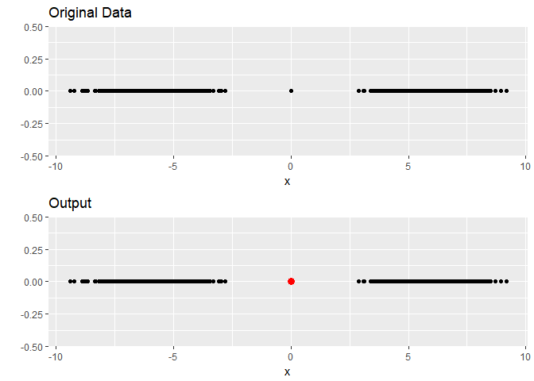

[](https://www.gnu.org/licenses/old-licenses/gpl-2.0.html) [](https://codecov.io/gh/pridiltal/stray)

------------------------------------------------------------------------

------------------------------------------------------------------------

[](http://www.repostatus.org/#active) [](https://www.gnu.org/licenses/old-licenses/gpl-2.0.html) [](https://codecov.io/gh/pridiltal/stray)

------------------------------------------------------------------------

[](https://cran.r-project.org/) [](https://cran.r-project.org/package=stray) [](commits/master)

------------------------------------------------------------------------

[](/commits/master) \#stray 

[](https://travis-ci.org/pridiltal/stray)

------------------------------------------------------------------------

<!-- README.md is generated from README.Rmd. Please edit that file -->
stray {STReam AnomalY}
======================

Robust Anomaly Detection in Data Streams with Concept Drift

This package is a modification of [HDoutliers package](https://cran.r-project.org/web/packages/HDoutliers/index.html). HDoutliers is a powerful algorithm for the detection of anomalous observations in a dataset, which has (among other advantages) the ability to detect clusters of outliers in multi-dimensional data without requiring a model of the typical behavior of the system. However, it suffers from some limitations that affect its accuracy. In this package, we propose solutions to the limitations of HDoutliers, and propose an extension of the algorithm to deal with data streams that exhibit non-stationary behavior. The results show that our proposed algorithm improves the accuracy, and enables the trade-off between false positives and negatives to be better balanced.

This package is still under development and this repository contains a development version of the R package *stray*.

Installation
------------

You can install oddstream from github with:

``` r
# install.packages("devtools")
devtools::install_github("pridiltal/stray")
```

Example
-------

One dimensional data set with one outlier

``` r
library(stray)
library(ggplot2)
set.seed(1234)
data <- c(rnorm(1000, mean = -6), 0, rnorm(1000, mean = 6))
df <- tibble::tibble( index = rep(0, length(data)), data = data)
data_plot <- ggplot(df, aes(x = data, y= index))+
  geom_point()+
  xlab("x")+
  ylab("")+
  ggtitle("Original Data")
data_out <- find_HDoutliers(data)
output_plot  <- data_plot +
  geom_point(data = df[data_out, ], aes(x=data, y = index), 
             colour = "red", size = 3)+
  xlab("x")+
  ylab("")+
  ggtitle("Output")
gridExtra::grid.arrange(data_plot, output_plot )
```


